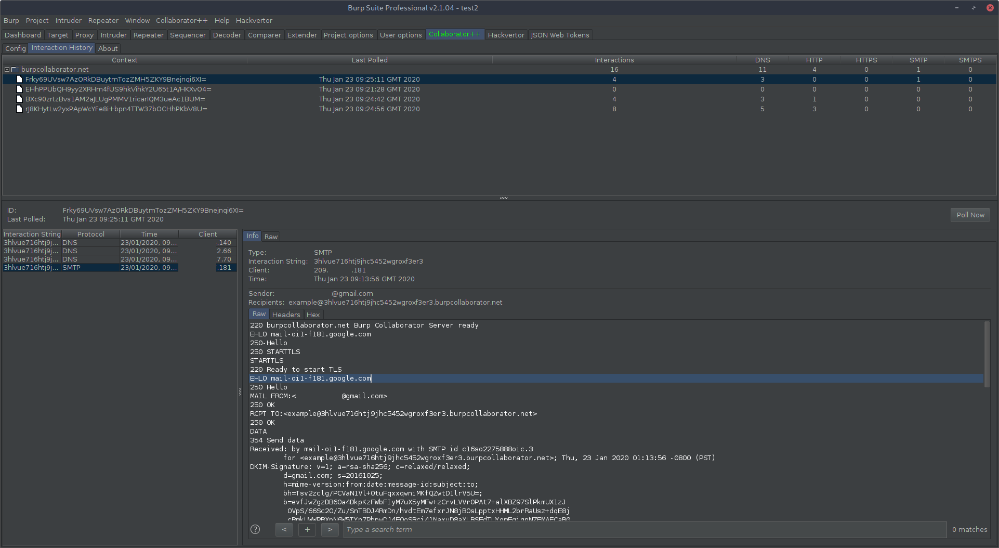

## CollaboratorPlusPlus
Released as open source by NCC Group Plc - http://www.nccgroup.com/

Developed by Corey Arthur, corey.arthur@nccgroup.com

http://www.github.com/nccgroup/CollaboratorPlusPlus

This project is released under AGPL see LICENSE for more information

Download from releases [here](https://github.com/nccgroup/CollaboratorPlusPlus/releases).

##### Background
This tool aims to extend upon the existing Collaborator functionality provided by Burp Suite, providing a 
number of quality of life features, and the implementation of an authentication mechanism to secure private collaborator
deployments, while still being compatible with all existing extensions which generate and poll Collaborator contexts. 

CollaboratorPlusPlus acts as a proxy between Burp and the configured Collaborator server, allowing the capture
of Collaborator contexts being used by the client. CollaboratorPlusPlus can then store and display the observed contexts
and their retrieved interactions in a central interface. In addition, old contexts can be polled manually, allowing
interactions to be retrieved even after the Collaborator client window has been closed.

##### Authentication Mechanism

In addition to the Burp Extension, the Collaborator++ project also includes an optional server-side authentication component 
to authenticating incoming polling requests before passing them to the Collaborator server. This can be deployed by owners of private Burp Collaborator servers to restrict polling to only those with knowledge of the shared secret.

When Burp requests the list of interactions received by the Collaborator server, the extension 
encrypts the polling requests with the AES256-CBC encryption scheme, using the shared secret 
to generate the encryption key. Provided the shared secret is correct, the authentication 
server is able to decrypt the request and forward it to the Collaborator server
to retrieve the interactions for the given Collaborator instance. The response is then 
encrypted with the shared-secret before being sent back to the Burp client.
 
By using the shared-secret to encrypt the transmission between the Burp client and the authentication server,
the shared-secret does not need to be transmitted along with the request, allowing confidentiality to be
maintained even in cases where HTTP communication must be used between the client and server. 

## Collaborator++ - Client

##### Running the Client
1. Add the extension to Burp
    - Note: This is the same JAR as the server.
2. Specify the address and the port the Collaborator Server is listening on within the extension config.
3. Optional: If you are using to a Collaborator Auth server, specify the shared secret and enable authentication in the extension config.
4. Start the local server, this will also configure the collaborator settings within Burp for you.
5. Optional: Run Burp's Collaborator health check to make sure everything is working.

##### Additional Settings
A few additional settings have been added to Collaborator Auth for convenience.

**Use SSL:** Toggle the use of SSL between the client and server. 
*Be sure your server is configured to use SSL on the target port too.*

**Ignore Certificate Errors:** Disables certificate validity checks. 
*Allows usage of self-signed / expired certificates.*

**Enable SSL Hostname Verification:** Do not check the certificate hostname matches the target domain.

**Block Public Collaborator Server:** Prevents accidental usage of the public Burp collaborator server.
Adds a DNS entry for *"burpcollaborator.net"* to *127.0.0.1* in Burp's hostname resolution config.

## Collaborator Auth - Server

##### Running the Server
1. Execute `java -jar CollaboratorPlusPlus.jar` to generate the default configuration.
    - Note: This is the same JAR as the client.
2. Edit the generated file to point to your private collaborator instance and choose a suitable secret.
3. Run the server again and specify the configuration to be used `java -jar CollaboratorPlusPlus.jar YOURCONFIGFILE.properties`

*Note: To allow HTTP and HTTPS requests to the Collaborator++ Auth server, create two copies of the configuration file, 
configuring one for HTTP and one for HTTPS and run two instances of the Collaborator++ Auth server.*

##### SSL Configuration

To enable the usage of SSL, generate a certificate for the server and use one of the below methods to configure the server.

For both methods, ensure `enable_ssl` is `true` in the config file. 

##### Recommended: Simple Configuration

1. Generate a new private key and certificate to use for the server using the following command, or use an existing one.
    - `openssl req -newkey rsa:2048 -nodes -keyout privatekey.pem -x509 -days 365 -out certificate.pem`
1. Optional: Get the certificate signed by a trusted CA.
1. Edit the config file:
    - Set `ssl_private_key_path` to the path of your private key.
    - Set `ssl_certificate_path` to the path of your certificate.
    - If your certificate chain requires an intermediate certificate:
        - Set `ssl_intermediate_certificate_path` to the path of your intermediate certificate.

##### Alternative: Java Keystore

This method was added purely for compatability reasons. I highly recommend using the simple configuration unless
there is a reason otherwise.  

1. Edit the config file and set the serializedValue for `ssl_private_key_path` to an empty string `""`. 
    - This will enable the use of the keystore for configuration. 
1. Generate a new private key and certificate to use for the server using the following command.
    - `openssl req -newkey rsa:2048 -nodes -keyout privatekey.pem -x509 -days 365 -out certificate.pem`
1. Convert the key and certificate to PKCS12. 
    - `openssl pkcs12 -export -in certificate.pem -inkey privatekey.pem -out polling.p12 -name polling`
1. Enter a password to be used for encrypting the PKCS12 file. **This will be used in the next step!** 
1. Import the PKCS12 file into a new Java Keystore. 
    - `keytool -importkeystore -deststorepass NEW_PASSWORD_FOR_KEYSTORE -destkeypass NEW_PASSWORD_FOR_PRIVATE_KEY \ `
     `-destkeystore polling.jks -srckeystore polling.p12 -srcstoretype PKCS12 \ `
     `-srcstorepass PASS_FROM_PREVIOUS_STEP -alias polling`  
1. Edit the configuration file to enable ssl, point the server to the keystore and specify the passwords used.
1. Run the server again and specify the configuration to be used `java -jar CollaboratorAuth-SERVER.jar CollaboratorServer.properties`

#### Recommended: Secure the *actual* Collaborator Server

To prevent polling of the Collaborator Server without the usage of Collaborator Auth, 
the Burp Collaborators polling location must be restricted. 

This may be done using your firewall, or by modifying the listening interface for polling events.

**Option 1 - Always require usage of Collaborator Auth.**

Should you wish to force users of your Burp Collaborator instance to authenticate regardless of their network, 
Burp Collaborator can be configured to listen to polling events only on the local machine (i.e. from Collaborator Auth).

This can be done by changing Burp Collaborator's listening address for polling events to the loopback interface (127.0.0.1) or 
using something like iptables to drop incoming requests.

**Option 2 - Only require usage of Collaborator Auth on external networks.**
  
To allow Burp Collaborator to be used as normal when on the same network as the server, but require Collaborator Auth
to be used when on an external network, Burp Collaborator can be configured to listen to polling events from
internal addresses.

This can be done by changing Burp Collaborator's listening address to polling events to the server's internal address 
(192.168.x.x, 10.x.x.x, etc.). 

To ensure external polling events are not processed by Burp Collaborator, the polling port should be blocked on the
internet facing firewall. Alternatively, use iptables to drop incoming traffic from external networks.
